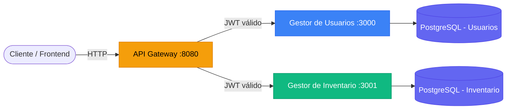
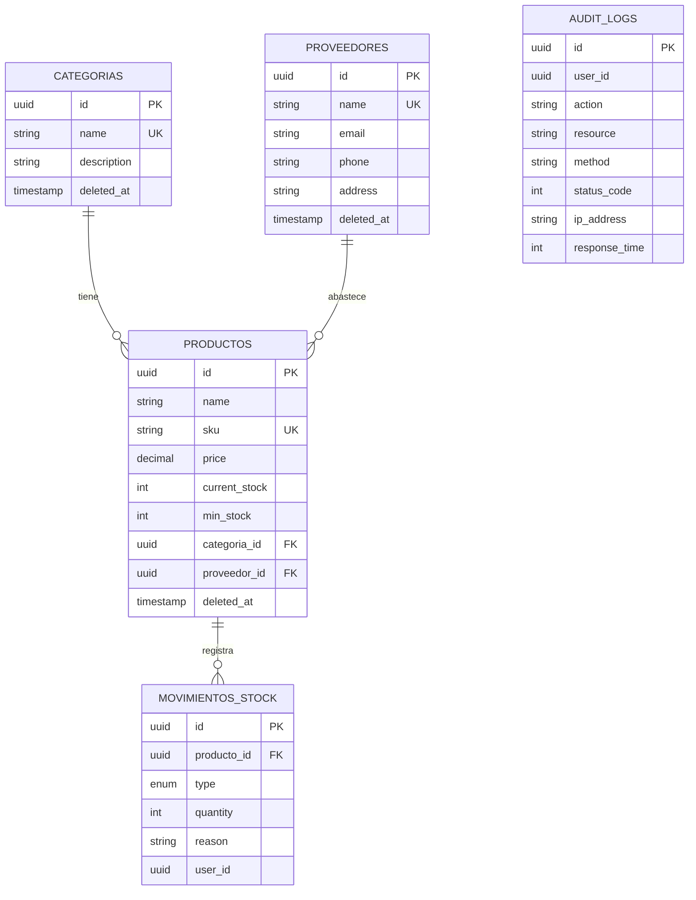

# 📦 Sistema de Gestión de Inventario — Microservicios


Sistema backend de gestión de inventario construido con **arquitectura de microservicios**. Incluye gestión de usuarios con RBAC, control de stock con movimientos transaccionales, auditoría automática, y un API Gateway como punto de entrada unificado.

---

## 🏗️ Arquitectura



### Flujo de una request

```
1. Cliente envía request al Gateway (:8080)
2. Gateway valida el JWT (excepto /api/auth/*)
3. Gateway inyecta headers x-user-id, x-user-email, x-user-role
4. Gateway hace proxy al servicio correspondiente
5. El servicio procesa, el middleware de auditoría registra la operación
6. Respuesta paginada vuelve al cliente
```

---

## ⚡ Features

| Feature | Detalle |
|---|---|
| **Microservicios** | 3 servicios independientes comunicados vía HTTP |
| **API Gateway** | Proxy reverso con validación JWT centralizada |
| **Auth JWT + RBAC** | Autenticación con roles y permisos granulares |
| **CRUD completo** | Categorías, Proveedores, Productos, Movimientos |
| **Stock transaccional** | Entradas, salidas y ajustes con row-level locking |
| **Paginación** | Todos los listados con `page`, `limit`, metadata completa |
| **Auditoría automática** | Middleware que registra cada operación en `audit_logs` |
| **Validación** | Schemas Zod en todas las rutas |
| **Health Checks** | Verificación de DB y upstreams con latencia |
| **Swagger Docs** | Documentación OpenAPI completa en `/api-docs` |
| **Docker Compose** | Orquestación de todos los servicios + bases de datos |
| **Tests** | 94 tests (unit + integración) con Jest y Supertest |
| **ESLint** | Airbnb Base config con reglas personalizadas |

---

## 📁 Estructura del Proyecto

```
inventario/
├── docker-compose.yml              # Orquestación de servicios
├── .env.example                    # Variables de entorno (root)
│
├── gateway/                        # API Gateway
│   ├── src/
│   │   ├── app.js                  # Express + proxy config
│   │   ├── config/env.js           # Variables de entorno
│   │   ├── middlewares/auth.js     # Validación JWT centralizada
│   │   └── server.js
│   ├── Dockerfile
│   └── .env.example
│
└── gestor-inventario/              # Servicio de Inventario
    ├── src/
    │   ├── config/                 # DB, Swagger, env (Zod)
    │   ├── controllers/            # Controladores REST
    │   ├── database/
    │   │   ├── migrations/         # 5 migraciones
    │   │   └── seeders/            # 3 seeders con datos demo
    │   ├── errors/                 # AppError + errores HTTP
    │   ├── middlewares/            # Auth, Audit, RateLimiter, Validate
    │   ├── models/                 # Sequelize (5 modelos)
    │   ├── routes/                 # Rutas + Swagger JSDoc
    │   ├── services/               # Lógica de negocio
    │   ├── utils/                  # Paginación helper
    │   └── validations/            # Schemas Zod
    ├── tests/
    │   ├── unit/                   # 49 unit tests
    │   ├── integration/            # 45 integration tests
    │   └── helpers/                # JWT helper + mocks compartidos
    ├── Dockerfile
    └── .env.example
```

> 📌 El [Gestor de Usuarios](https://github.com/RodriArrue/Gestor-de-Usuarios) es un repositorio separado con su propia estructura.

---

## 🚀 Setup Rápido

### Con Docker (recomendado)

```bash
# 1. Clonar los repos
git clone https://github.com/RodriArrue/Gestor-de-Usuarios.git GestordeUsuarios
git clone https://github.com/RodriArrue/Gestor-de-Inventario.git inventario

# 2. Configurar variables de entorno
cd inventario
cp .env.example .env

# 3. Levantar todos los servicios
docker compose up --build
```

### Desarrollo local (sin Docker)

```bash
# Terminal 1 — Gestor de Inventario
cd gestor-inventario
cp .env.example .env          # Editar con tus credenciales de PostgreSQL
npm install
npm run db:migrate
npm run db:seed
npm run dev

# Terminal 2 — Gateway
cd gateway
cp .env.example .env
npm install
npm run dev
```

---

## 📡 API Endpoints

Todos los endpoints se acceden a través del **Gateway** (`http://localhost:8080`).

### 🔓 Públicos (sin JWT)

| Método | Ruta | Descripción |
|---|---|---|
| `POST` | `/api/auth/register` | Registro de usuario |
| `POST` | `/api/auth/login` | Login → retorna JWT |
| `GET` | `/health` | Health check del Gateway + upstreams |

### 🔒 Protegidos (requieren JWT)

| Método | Ruta | Descripción |
|---|---|---|
| `GET` | `/api/categorias` | Listar categorías (paginado) |
| `POST` | `/api/categorias` | Crear categoría |
| `GET` | `/api/categorias/:id` | Detalle de categoría |
| `PUT` | `/api/categorias/:id` | Actualizar categoría |
| `DELETE` | `/api/categorias/:id` | Eliminar categoría (soft delete) |
| | | |
| `GET` | `/api/proveedores` | Listar proveedores (paginado) |
| `POST` | `/api/proveedores` | Crear proveedor |
| `GET` | `/api/proveedores/:id` | Detalle con productos |
| `PUT` | `/api/proveedores/:id` | Actualizar proveedor |
| `DELETE` | `/api/proveedores/:id` | Eliminar proveedor |
| | | |
| `GET` | `/api/productos` | Listar productos (paginado, filtros) |
| `GET` | `/api/productos/low-stock` | ⚠️ Productos bajo stock mínimo |
| `GET` | `/api/productos/sku/:sku` | Buscar por SKU |
| `POST` | `/api/productos` | Crear producto |
| `PUT` | `/api/productos/:id` | Actualizar producto |
| `DELETE` | `/api/productos/:id` | Eliminar producto |
| | | |
| `GET` | `/api/movimientos` | Historial de movimientos (paginado) |
| `GET` | `/api/movimientos/producto/:id` | Movimientos de un producto |
| `POST` | `/api/movimientos` | Crear movimiento (entrada/salida/ajuste) |

#### Ejemplo de respuesta paginada

```json
{
  "status": "success",
  "data": [ ... ],
  "pagination": {
    "totalItems": 50,
    "totalPages": 5,
    "currentPage": 2,
    "itemsPerPage": 10,
    "hasNextPage": true,
    "hasPrevPage": true
  }
}
```

---

## 🧪 Tests

```bash
cd gestor-inventario
npm test
```

```
Test Suites: 8 passed, 8 total
Tests:       94 passed, 94 total

  Unit Tests (49):
    ✓ CategoriaService   — 14 tests
    ✓ ProveedorService   — 10 tests
    ✓ ProductoService    — 16 tests
    ✓ MovimientoStock    — 9 tests

  Integration Tests (45):
    ✓ /api/categorias    — 14 tests
    ✓ /api/proveedores   — 10 tests
    ✓ /api/productos     — 12 tests
    ✓ /api/movimientos   — 10 tests (transacciones)
```

---

## 📖 Documentación Swagger

Con los servicios levantados:

| Servicio | URL |
|---|---|
| Gestor de Usuarios | http://localhost:3000/api-docs |
| Gestor de Inventario | http://localhost:3001/api-docs |

---

## 🔧 Stack Tecnológico

| Capa | Tecnología |
|---|---|
| **Runtime** | Node.js 22 |
| **Framework** | Express 5 |
| **ORM** | Sequelize 6 |
| **Base de datos** | PostgreSQL 16 |
| **Validación** | Zod |
| **Autenticación** | JWT (jsonwebtoken) |
| **Documentación** | Swagger (swagger-jsdoc + swagger-ui-express) |
| **Testing** | Jest + Supertest |
| **Linting** | ESLint (Airbnb Base) |
| **Contenedores** | Docker + Docker Compose |

---

## 🗄️ Modelo de Datos



---

## 👤 Autor

**Rodrigo Arrue** — [GitHub](https://github.com/RodriArrue)
